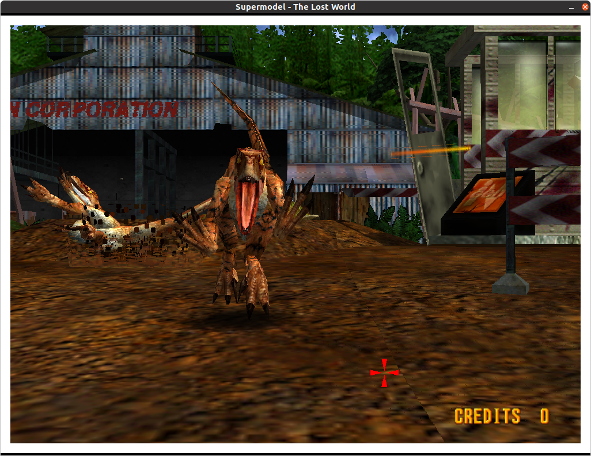

# Sega Model 3 Arcade Emulator (Sinden)

This is a fork of [model3emu-code](https://www.supermodel3.com) to add native **Sinden** light gun support.

It will attempt to track SVN commits.

Additional arguments:

    -borders=<n>      Sinden border configuration for gun games:
                      0=none [Default], 1=standard, 2=wide
    -nomousecursor    Disable desktop mouse cursor in SDL Windowed mode

For `arm` based systems, clone the `arm` branch:

    git clone --single-branch --branch arm https://github.com/DirtBagXon/model3emu-code-sinden.git

